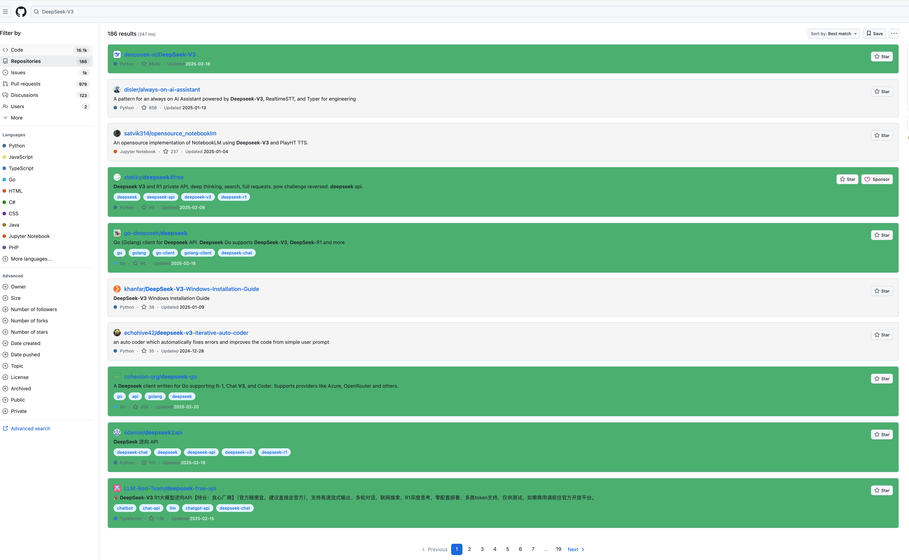
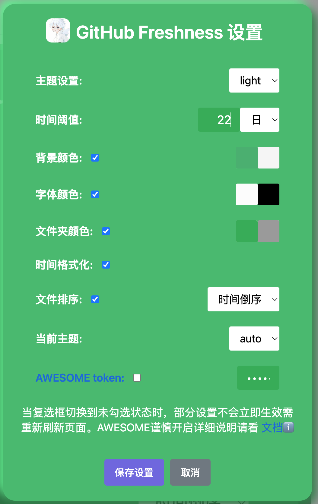

# 目录

1. [预览效果图](#预览效果图)
2. [背景](#背景)
3. [介绍](#介绍)
4. [使用教程](#使用教程)
5. [GitHub-Freshness 版本日志](#github-freshness-版本日志)
6. [声明](#声明)
7. [Star History](#star-history)
8. [TG交流群](#tg交流群)

---
# 预览效果图
以下效果皆可在设置界面自定义 
# github 项目界面预览

# github 搜索界面预览

# github Awesome-xxx项目预览

## 设置界面

# **背景：**

作为一个喜欢在 GitHub 上寻找 JavaScript 脚本的开发者，我经常发现那些高星标的项目已经好几年没有更新，完全没有得到维护，浪费了大量的时间。为了帮助自己快速判断一个仓库是否还在更新，并查看它的最新更新时间，我开发了这个油猴脚本。我相信，很多开发者和我一样，都会遇到这种烦恼，渴望更高效地发现那些仍然活跃的项目。

# **介绍：**

**GitHub Freshness** 提供 Chrome 扩展版和油猴脚本版，通过颜色高亮的方式，帮助你快速判断一个 GitHub 仓库是否在更新。你可以通过设置面板来自定义颜色，并根据仓库的更新时间，轻松识别哪些项目仍在维护，哪些已经被遗弃。再也不用浪费时间在过时的项目上，寻找最新更新、活跃的资源更加高效！本仓库公开油猴脚本与文档，Chrome 扩展由作者单独发布，不在公开仓库中提供扩展源码。

## 使用教程

### Chrome 扩展版

Chrome 扩展由作者通过官方渠道单独发布，不需要安装 Tampermonkey。公开仓库不再提供 `extension` 源码目录或“加载已解压的扩展程序”安装方式；获取说明请查看[Chrome 扩展文档](https://docs.rational-stars.top/chrome-extension.html)。

### 油猴脚本版

点击安装[油猴扩展](https://www.tampermonkey.net/index.php)插件：https://www.tampermonkey.net/index.php

**点击链接安装**[GitHub Freshness](https://greasyfork.org/zh-CN/scripts/524465-github-freshness)油猴脚本：https://greasyfork.org/zh-CN/scripts/524465-github-freshness

点击右上角扩展插件中的 GitHub Freshness 设置面板，然后设置喜欢的颜色、时间阈值和当前语言即可。脚本兼容 GitHub 中文和英文界面下的更新时间解析，过于简单不再赘述。

详细使用教程点击去往[GitHub Freshness 在线文档](https://docs.rational-stars.top/)

# GitHub-Freshness 版本日志
[版本日志](/docs/version-log.md)

# TG交流群

想要一起畅聊吹水 GitHub 使用技巧、解决bug，甚至分享你最喜欢的配色方案？快来加入我们的 [GitHub Freshness TG交流群](https://t.me/GitHubFreshness)吧！现在是群内最早的一批成员，加入后你将成为我们共同进步的一部分。无论是对脚本的想法，还是对未来功能的需求，还是参与开发，都可以在这里和大家一起讨论。让我们一起让 GitHub 更加高效！期待你的加入！
https://t.me/GitHubFreshness

# 声明

Chrome 扩展版和油猴脚本版均秉承「不作恶」的原则，无需用户注册登录，不跟踪、不记录任何用户信息，无需关注公众号，不添加广告。

油猴脚本功能皆为原创，公开源码无隐藏、混淆和加密代码，可供用户查阅学习。Chrome 扩展源码不包含在本公开仓库中。

## Star History

