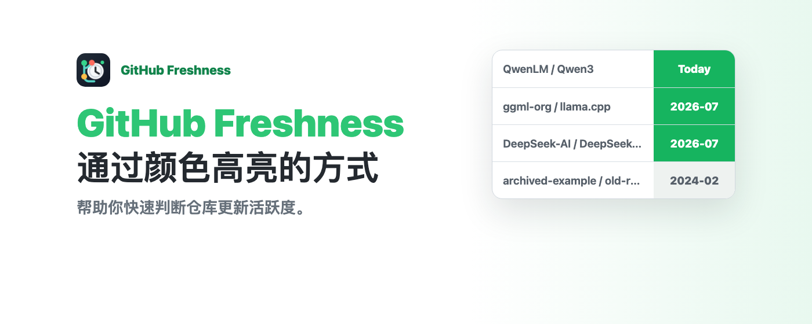
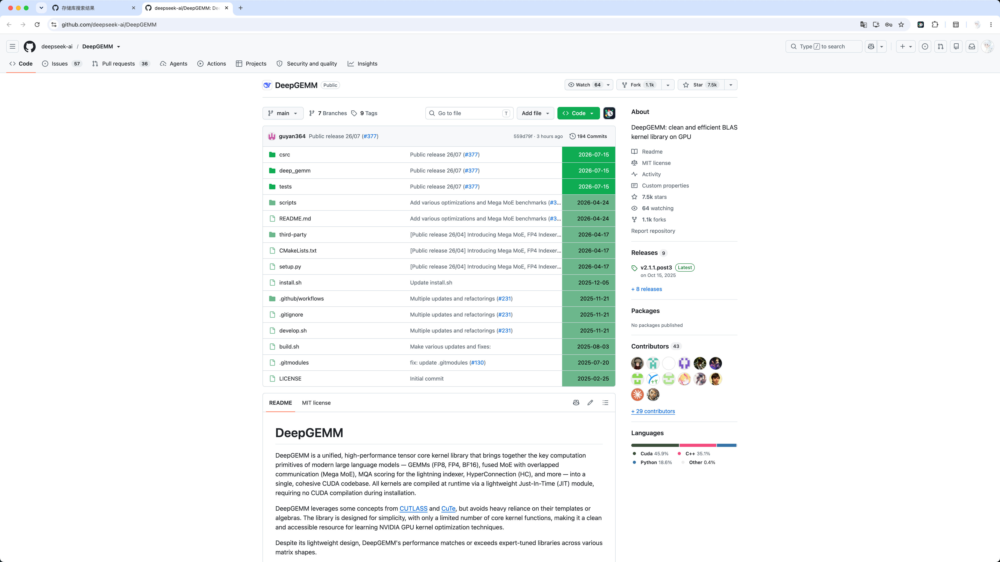
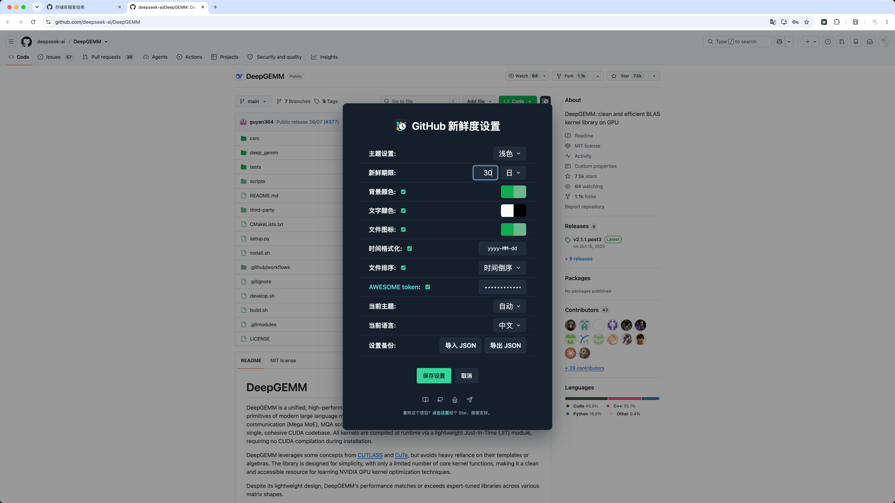
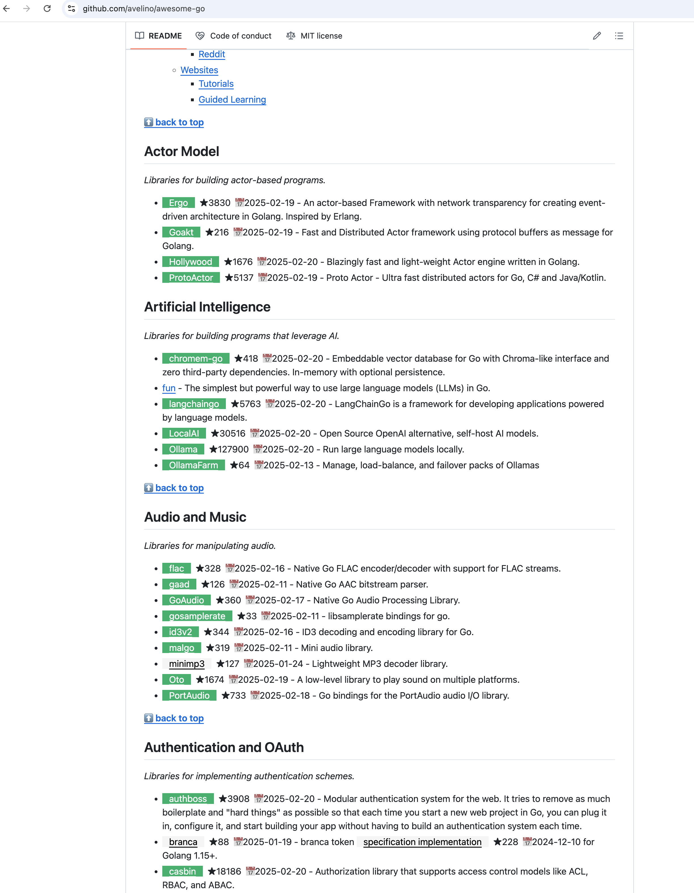

[简体中文](./README.md) | [English](./README_EN.md)

# GitHub Freshness

GitHub Freshness 通过颜色标记 GitHub 仓库、文件和搜索结果的更新时间，帮助你快速判断项目是否仍在活跃维护。

项目提供 Chrome 扩展版和 Tampermonkey 油猴脚本版。Chrome 扩展已经提交 Chrome Web Store，目前正在等待审核；审核通过后会在这里补充正式安装链接。

## 主要功能

- 根据自定义“新鲜期限”标记近期和较早更新的内容。
- 支持仓库文件列表、目录树和 GitHub 搜索结果。
- 自定义浅色与深色主题的背景、文字和文件图标颜色。
- 按更新时间排序文件，并可将相对时间显示为 `yyyy-MM-dd`。
- 通过 JSON 导入、导出设置，备份文件不会包含 AWESOME token。
- 设置面板支持中文和英文，并可在页面内快速打开。
- 可选的 Awesome 项目增强功能会显示仓库 Star 数量和最近更新时间。

## 效果预览

### 仓库文件新鲜度

### 设置面板

### Awesome-xxx 项目

更多目录树、搜索结果和深色主题截图请查看[完整效果预览](https://rational-stars.github.io/GitHub-Freshness/preview.html)。

## 安装

### Chrome 扩展

Chrome 扩展已提交 Chrome Web Store，目前正在等待审核。扩展源码不包含在本公开仓库中，请勿从非官方来源安装扩展文件。

### Tampermonkey 脚本

1. 安装 [Tampermonkey](https://www.tampermonkey.net/)。
2. 从 [Greasy Fork 安装 GitHub Freshness](https://greasyfork.org/zh-CN/scripts/524465-github-freshness)。
3. 打开 GitHub 仓库页或搜索页，通过 GitHub Freshness 图标进入设置面板。

## 文档与隐私

- [完整文档](https://rational-stars.github.io/GitHub-Freshness/)
- [快速开始](https://rational-stars.github.io/GitHub-Freshness/getting-started.html)
- [功能设置](https://rational-stars.github.io/GitHub-Freshness/diy-settings/)
- [版本日志](https://rational-stars.github.io/GitHub-Freshness/version-log.html)
- [隐私政策](https://rational-stars.github.io/GitHub-Freshness/privacy/)

公开仓库包含油猴脚本和项目文档。Chrome 扩展独立发布，其源码不在本仓库公开。

## 反馈与交流

- [GitHub Issues](https://github.com/rational-stars/GitHub-Freshness/issues)
- [Telegram 交流群](https://t.me/GitHubFreshness)
- [个人主页](https://home.rational-stars.top/)

喜欢这个项目的话，可以在 GitHub 点一颗 Star，感谢支持。

## 许可证

油猴脚本和公开文档遵循 [MIT License](./LICENSE)。
