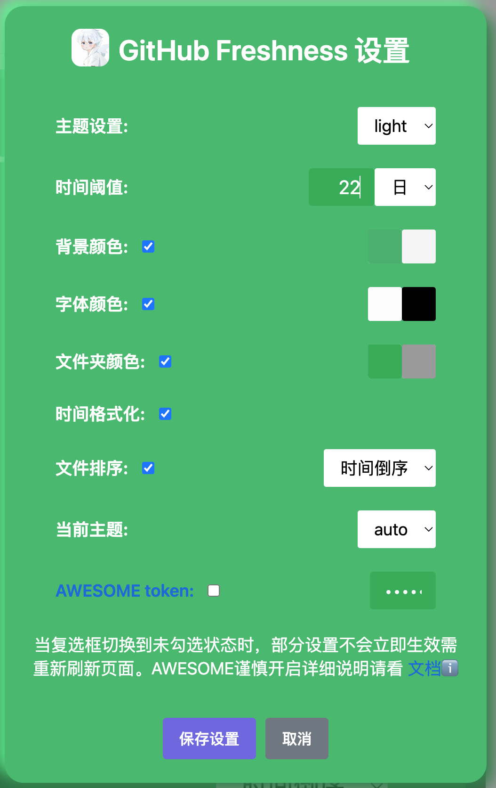

# 简介
当前项目是以项目的更新时间是否小于设定的时间阈值。
## 主题设置：
当前设置面板中的数据会保存到那个主题。 **light** 或者 **dark** 。
## 时间阈值
当前设置数据生效的条件，eg：22 天 就是当github 项目获取的更新时间小于 22 天之内就会以下方选择的数据生效到页面中去。**日 周 月 年**

## 颜色设置
**背景颜色**、**字体颜色**、**文件夹颜色**这些都是字面意思，可以看到这几个功能后面都是有两个颜色选项卡的左边是小于时间阈值的，右边是大于时间阈值的。

## 时间格式化
把原本的 github 项目中的更新时间转换成 yyyy-mm-dd。
## 文件排序
github 项目里的文件夹和文件都以时间进行升序或者降序

## AWESOME token

点击去往[AWESOME token](./awesome-xxx.md#awesome-token)