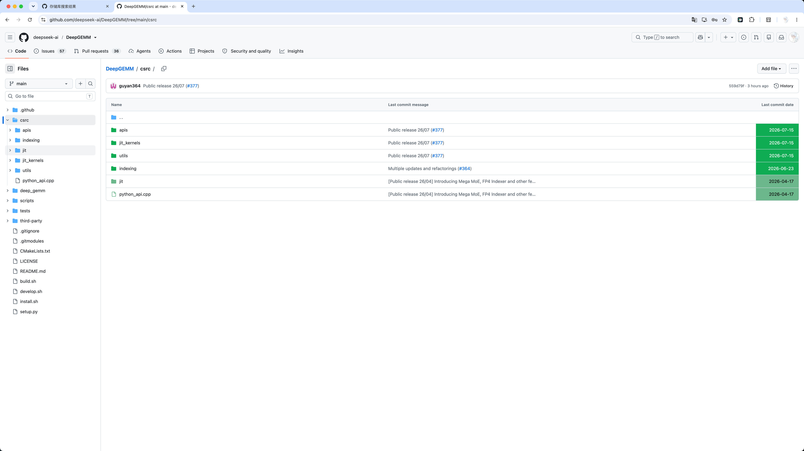
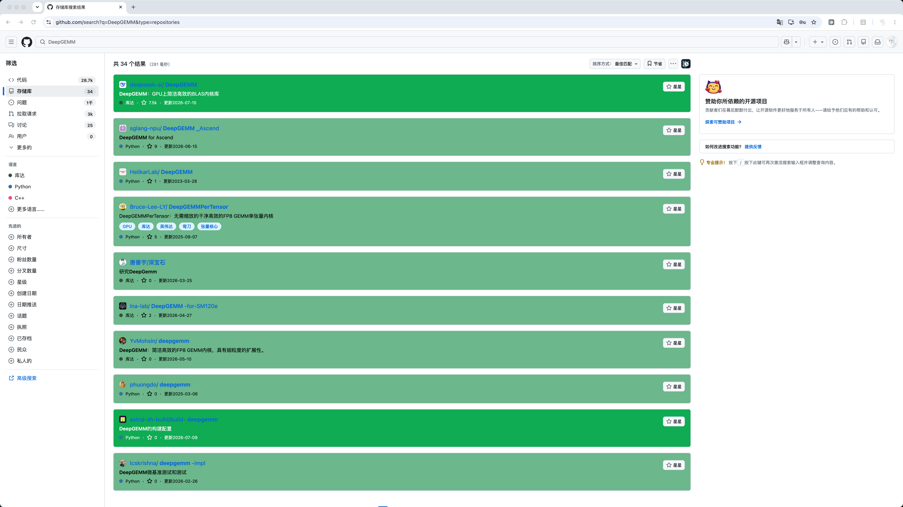
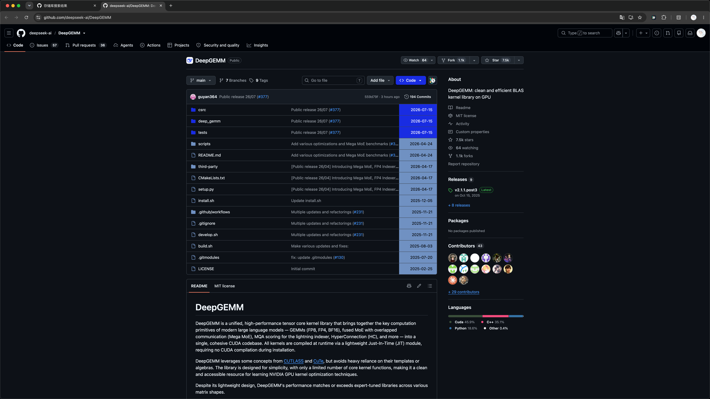
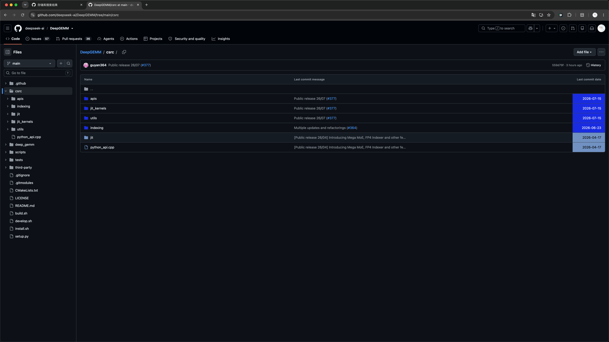
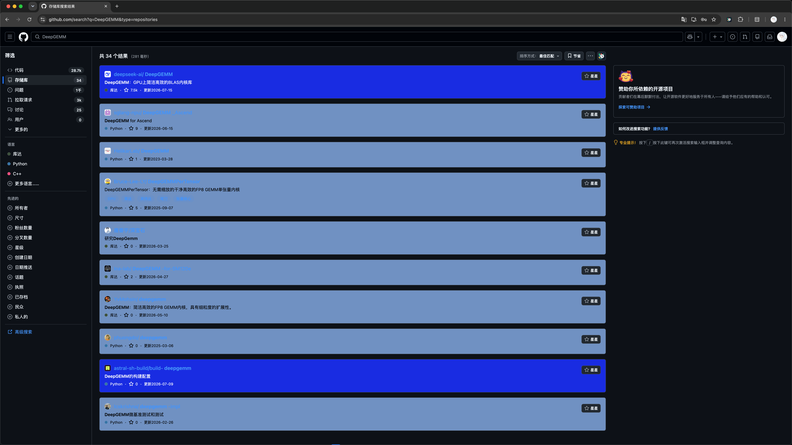

# 效果预览

GitHub Freshness 会根据你设置的“新鲜期限”，为近期更新和较早更新的内容使用不同颜色。下面的颜色仅为示例，背景、文字和文件图标颜色都可以在[功能设置](./diy-settings/index.md)中调整。

## 仓库文件列表

仓库主页会在原有 GitHub 布局中标记文件和目录的更新时间，并在 Code 按钮后提供设置入口。

## 设置面板

设置面板可以分别编辑浅色和深色配置，并管理新鲜期限、颜色、日期格式、文件排序、AWESOME token、当前主题、语言以及 JSON 备份。

## 目录树视图

进入仓库子目录后，GitHub Freshness 会继续处理目录树和当前文件列表，不需要返回仓库主页。

## GitHub 搜索结果

仓库搜索结果会整卡显示新鲜或过期背景色，描述、语言、Star 数量和更新时间会跟随文字颜色；仓库名称、Topic 和 Star 按钮保留 GitHub 原生样式。

## Awesome-xxx 项目

启用 AWESOME 功能后，可以在 Awesome 风格的项目列表中查看目标仓库的 Star 数量和最近更新时间。

## 深色主题

当前主题设为“自动”时，GitHub Freshness 会跟随系统的浅色或深色外观，并使用对应的独立配色。

### 深色仓库文件列表

### 深色目录树视图

### 深色搜索结果

